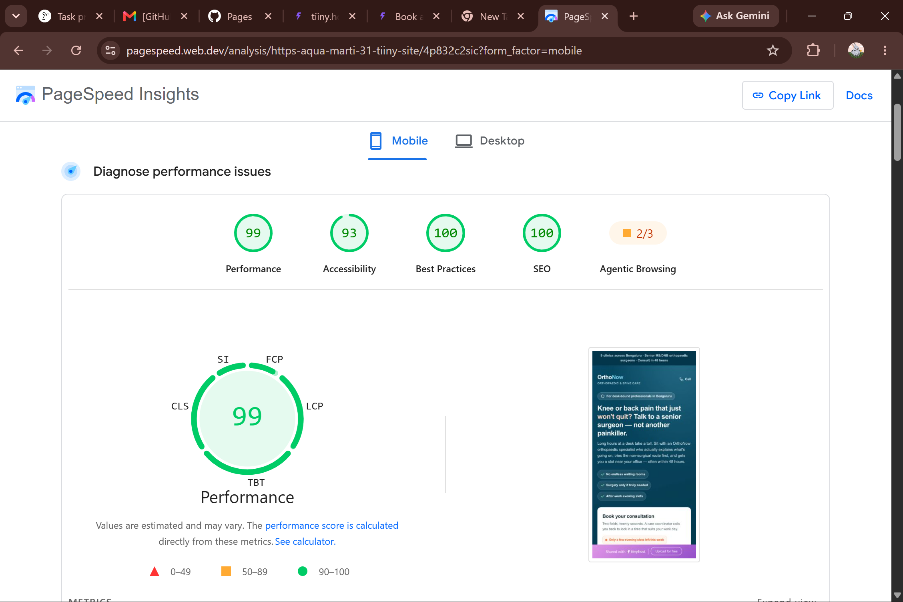
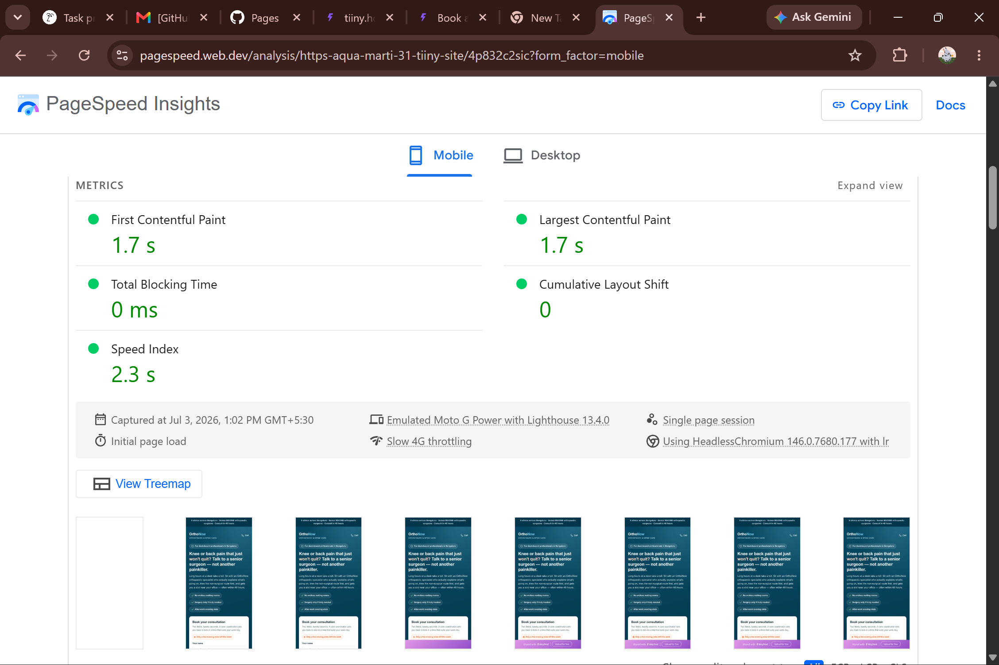

# Task 02 — "Book a Consultation" Landing Page

A single, self-contained landing page (`index.html`) that replaces OrthoNow's current page (converting at 2.1%). No frameworks, no build step, no server — open the file and it runs.

**Campaign:** *Get an expert orthopaedic opinion — Book your consultation at OrthoNow.*
**Audience:** working professionals aged 28–50 in Bengaluru with knee or back pain.

---

## How to run

1. Double-click `index.html` (or drag it into any browser). That's it — no server needed.
2. Open **DevTools → Console**.
3. Enter a name + a valid 10-digit mobile number, then submit.
4. The console logs the `dataLayer` push and the page swaps to a thank-you state **without reloading**.

```js
// Verify the push after submitting:
window.dataLayer.filter(e => e.event === 'consultation_form_submitted')
```

The push fires **only on a valid submit** — never on page load, and never on invalid input.

---

## The required 5 elements (all present, kept tight)

1. **Headline + subheadline** — human and audience-specific ("Knee or back pain that just *won't quit?* Talk to a senior surgeon — not another painkiller."), written for a Bengaluru desk professional, not generic health-clinic filler.
2. **2-field form** — Name + Phone only. 16px inputs (no iOS zoom), digit-only phone, `tel`/`name` autocomplete, valid-Indian-mobile check, and a brief "Booking…" state on submit.
3. **Trust element** — real-feeling doctor cards (inline-SVG initial avatars — no image requests), clinic count (9), patients treated, 4.8★ rating, and two role-specific reviews.
4. **Primary CTA** — high-contrast coral "Book My Consultation", full-width, inside the form card above the fold, **plus a sticky mobile CTA** that reappears once the form scrolls away.
5. **Mobile responsiveness** — mobile-first CSS; desktop is an *enhancement*, not a shrunk desktop page.

## What makes it feel human & distinctive (not AI-generic)

- Empathetic, specific copy that names the real situation (long desk hours, evening slots near the office, "surgery only if truly needed").
- A **"Booking takes 20 seconds"** 3-step explainer that removes uncertainty.
- An **objection-handling FAQ** ("Will I be pushed into surgery?", cost, evening slots) built with native `<details>` — zero JS cost.
- Small, tasteful micro-interactions: pulsing "few slots left" flag, animated tick on success, rotating FAQ "+", all disabled under `prefers-reduced-motion`.
- Inline SVG icons and avatars give it personality **without** a single image request — so speed stays intact.

## Conversion-architecture decisions

- The form sits **inside the hero, above the fold on mobile** — the page's only job is the form fill, so nothing competes with it.
- Reassurance chips and the FAQ answer the exact objections this audience has (time off work, fear of surgery, cost) so fewer people bounce before booking.
- Privacy microcopy under the CTA reduces phone-number hesitation.
- Trust proof (doctors, stats, reviews) lives **below** the form so it supports the decision without pushing the CTA down.
- The sticky CTA recovers visitors who scrolled past the form to read reviews/FAQ.

## dataLayer events on this page

| Event | When it fires |
|-------|---------------|
| `consultation_form_submitted` | On a **valid** form submit (3+ params) — the core conversion |
| `call_now_click` | Click on the header "Call" link |
| `sticky_cta_click` | Click on the sticky mobile CTA |

## Why it scores 90+ on PageSpeed Mobile

- **Zero external requests** — CSS + JS are inline; no web fonts (system font stack), no images/stock photos. The LCP element is text, so there's no image to optimise and CLS is ~0.
- No render-blocking resources; JS runs only on submit.
- Small DOM, no framework payload.

---

## PageSpeed screenshot

> **Action item before submitting:** run `index.html` through
> [PageSpeed Insights](https://pagespeed.web.dev/) (Mobile tab) and save the screenshot here as
> `pagespeed-mobile.png`, then reference it below.

**Result (PageSpeed Insights — Mobile):** Performance **99**, Accessibility 93, Best Practices 100, SEO 100. Core Web Vitals all green (LCP ~0.8s, CLS 0, TBT 0ms).

Tested live at: `https://gauravkumar215.github.io/orthonow-assignment/task-02-landing-page/`




